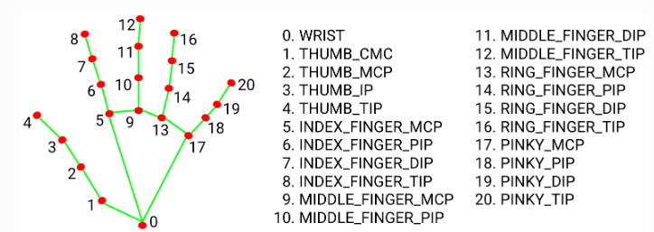
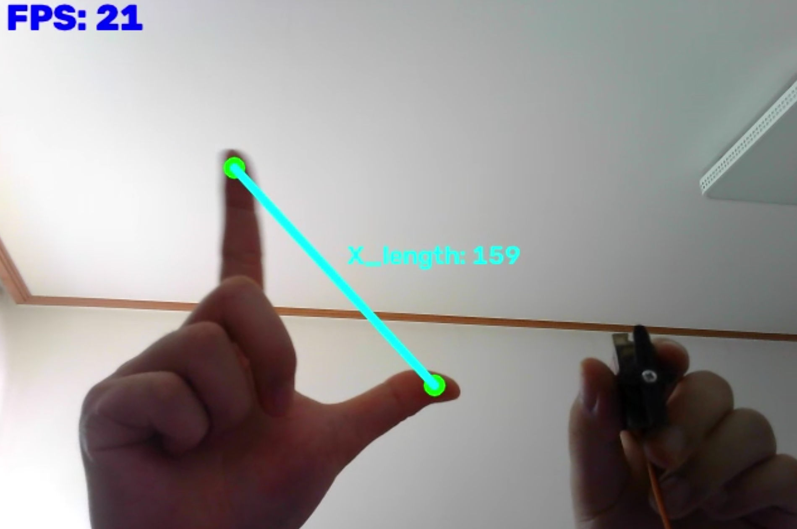

## 프로젝트 내용 요약
 - MediaPipe를 이용하여 손 동작 인식
 - 엄지, 검지의 라인 길이에 따라 Arduino 서보 모터 제어 방식

## 폴더 구조

```text
HandControl/
├─ servo_move
│  └─ servo_move.ino
├─ images/
├─ HandControl.py
├─ readme.md
└─ requirements.txt
```

## 설명

### 1. Hand Detection Landmarks


`4.THUMB TIP`과 `8.INDEX_FINGER_TIP` 활용

사진 출처: https://mediapipe.readthedocs.io/en/latest/solutions/hands.html

### 2. 실행 결과


엄지, 약지를 검출한 후 라인을 그어 라인 길이에 따른 Arduino 서보 모터 각도 제어

 
### 3. 버전 및 호환
```version
Tool: Vscode
Python: 3.11.9
MediaPipe: 0.10.9
Arduino: Arduino Uno
```

### 4. 시연영상
https://youtu.be/-ZlY28D--98